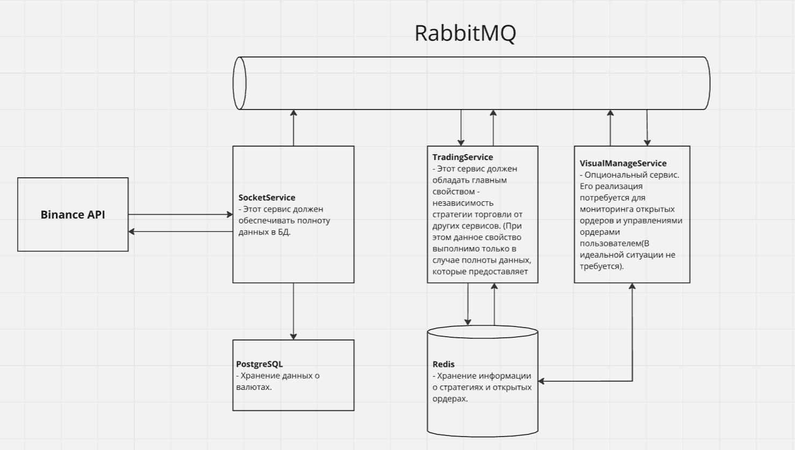

# TradingBot

<h1>Описание проекта</h1>

Данный проект направлен на реализацию высокочастотного трейдинга, основанного на 
различных стратегиях.

<h3>Математические стратегии разрабатываемые в проекте(базовый подход для старта): </h3>
1. Скользящее среднее;  
2. Мониторинг локальных экстремумов.  

<h3>Первичная структура и стек:</h3>

